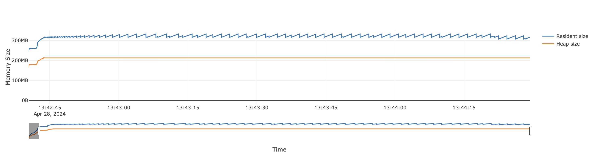

# PG-BART Improvements

This document outlines: (1) areas subject to performance and memory allocation improvements for the PyMC-BART codebase, and (2) potential methods to address these areas of improvement. First, an overview of the code profiling results is provided. Following the profiling results, several methods and languages will be discussed that could be utilized to improve the performance and memory allocation of the PyMC-BART codebase.

## Code profiling results

Code profiling was conducted using the `line_profiler` and `memray` packages for time and memory profiling, respectively. Below, a summary of the profiling results is provided. For specific details, refer to the `README.md` file within each `line_profiler` and `memray` directory of this module.

### Line profiling

In order to provide line-by-line profiling, specific functions and methods have been decorated with `@profile` to obtain a line-by-line timing profile within _that_ function or method. In our case, we are interested in profiling the `.astep` method (and the subsequent call stack) of the `PGBART` sampler as this method represents the main entry point of the particle sampler. Overall, eight functions and or methods are profiled:

```bash
└── astep
    ├── sample_tree
    │   └── grow_tree
    │       └── draw_leaf_value
    ├── update_weight
    │   └── logp
    └── resample
        └── systematic
```

Below are the main takeaways from the line profiling results.

As expected, the majority of the time is spent within loops of the `astep` method. Within the loops, there are several calls to other functions or methods performing computations.

When running PG-BART for 500 iterations, 200 trees, and 60 particles, the following line profiling results are obtained (averaged across all benchmark case studies with these hyperparameter values):

```bash
└── astep (354s)
    ├── sample_tree (34% or 106s)
    │   └── grow_tree (92% or 80s)
    │       └── draw_leaf_value (35% or 15s)
    │           └── fast_mean (66%)
    ├── update_weight (59% or 205s)
    │   └── logp (90% or 0.30s)
    │       └── pytensor_function (99%)
    └── resample (4% or 12s)
        ├── new_particles.append (87%) # if/else statements
        └── systematic (5.2%)
```

Where `%` indicates percent of time spent executing that line of code, and `s` indicates seconds spent executing that line of code. The tree-diagram represents the call stack and only the **time intensive** lines are shown for brevity.

An interesting observation is that even though there are _several_ computations and or function calls within the loops, typically only a _few_ of them are responsible for the percentage of total time.

#### Notes

* If `logp` takes the majority of the time in `update_weight`, why is the total time of 0.30s so low? I would expect this number to be around 185s. 
* Need to understand what exactly `pytensor_function` is doing and why it is taking so long.
* `fast_mean` is JIT compiled, but still represents a significant portion of the time spent in `draw_leaf_value`.
* `new_particles.append` in `resample` is within `if/else` statements. This control flow is also resulting in increased time execution.

### Memory profiling

With `memray`, the majority of peak memory usage (ignoring import and irrelevant frames) at any given point in time comes from the initialization of PG-BART when calling `pmb.PGBART`. Within the `astep` method, the memory usage as a percent of total, is relatvively low. Nonetheless, within `astep`, the main memory usages comes from `update`, `resample`, and `sample_tree`. This makes intuitive sense as these methods or functions are responsible for growing the trees, updating the weights, and then resampling of the particles using the new weights.

Below, the temporal graph of heap and resident memory usage for the coal case study with 500 iterations, 200 trees, and 60 particles is shown.



A large increase in resident and heap size is observed due to import frames and the initialization of PG-BART. After, resident and heap size increases and then becomes constant.

However, when viewing the `stats` reporter to obtain total memory allocations and size over a program's entire execution, we see a large amount of total memory being allocated. Additionally, the size (in MB and GB) resulting from these allocations is also quite large and varies from case-study to case-study. The top 10 largest allocation locations (by size and number of allocations) across all case studies are:

* `_predict` 
* `grow_tree`
* `update_weight`
* `draw_leaf_value`

#### Notes

* Is the `memray` `stats` reporter even correct? This seems like a HUGE amount of total memory allocations and size.
* Currently, at each step PG-BART fits $n$ out of $m$ trees, but all $m$ trees are stored in memory. This makes it easier to track state and for computing the sum of trees but it is a waste of memory.
* Could caching and or memoization improve memory usage in some areas?

## Solutions

The profiling results above indicate that our problem is CPU bound, i.e. the majority of time is spent doing computational work and allocating memory within for loop(s) with minimal idle time waiting for I/O or other external operations to complete. 

Due to this, our focus should be on improving the speed of loops and the computations happening within them. Within the loops, there are repetitive operations where the same computation is performed, albeit on different data with the same data types. This leads us to consider ahead of time (AOT) and just in time (JIT) compilation, vectorization, and parallelization as potential solutions to improve the speed performance of PG-BART.

### Ahead of time and just in time compilation

_Ahead of time compilation_ (AOT): Refers to compiling code prior to execution.

* AOT compilation eliminates the need for runtime environment or a virtual machine (VM), reducing memory usage and startup times.
* AOT compiled code may not be as optimized as JIT compiled code since it cannot leverage runtime information, e.g. to gain information about CPU intensive code.
* Type annotations of objects used in inner loops.
* If using Cython, could "Cythonize" the binary tree.

_Just in time compilation_ (JIT): Refers to compilation that happens dynamically during program execution rather than ahead of time.

* JIT compiler translates bytecode into machine instructions at runtime, just before executing it.
* Allows the JIT compiler to optimize the machine code using runtime information and only compile code paths that are actually executed.

If we re-write parts of PG-BART in Cython and or the entire codebase in Rust, we would get the benefits of AOT compilation. This would improve the speed of loops and potentially reduce memory usage.

### Vectorization and parallelization

Another area of improvement in PG-BART is vectorization and parallelization. It has been [shown](https://github.com/Gattocrucco/bartz) that BART can be vectorized resulting in a significant speedup. The linked repo above achieves vectorization (and parallelization) using JAX, and vectorizes the growing of trees. Furthermore, a JAX implementation can be ran on accelerators (e.g. GPUs/TPUs) as JAX uses an XLA compiler.

### Comparison

| Framework | Rewrite? | Impl. Difficulty | Compilation | Vectorization | Parallelization | Accelerator Support |
|-----------|----------|------------------|-------------|---------------|-----------------|---------------------|
| JAX       | Yes      | Medium           | JIT         | `vmap`        | `pmap`          | Yes                 |
| Cython    | Partial  | Medium           | AOT         | ?             | OpenMP          | ?                   |
| Rust      | Yes      | High             | AOT         | Native        | Native?         | ?                   |            

#### JAX

Rewriting the PG-BART codebase in JAX would allow:
* JIT compilation
* Automatic vectorization `vmap` and parallelization `pmap`
* Ability to run BART on accelerators (e.g. GPU/TPUs) in addition to CPU as JAX uses the XLA compiler.

An implementation of BART in JAX already [exists](https://github.com/Gattocrucco/bartz).

#### Cython

Rewriting the PG-BART codebase in Cython would allow:
* AOT compilation
* OpenMP support for parallelization
* Only need to rewrite parts of the PG-BART codebase.

Scikit-learn implements their tree-based algorithms in Cython.

#### Rust

Rewriting the PG-BART codebase in Rust would allow:
* AOT compilation
* Rust compiler has auto-vectorization capabilities.
* Crates such as `rayon` can be used for parallelization.

An implementation of BART in Rust already [exists](https://github.com/elanmart/rust-pgbart/tree/main).