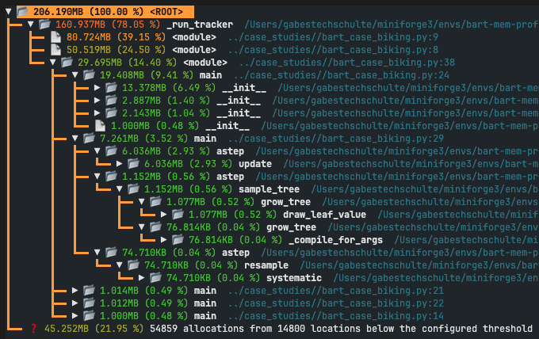
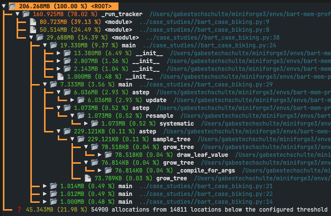
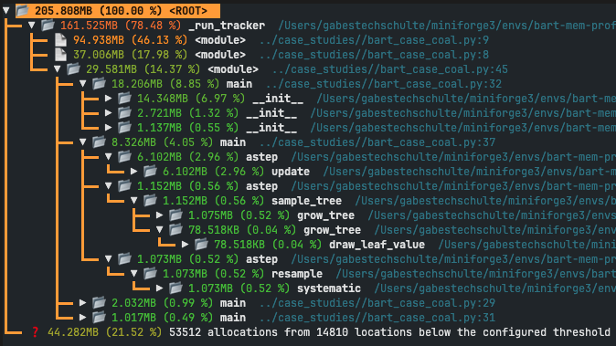
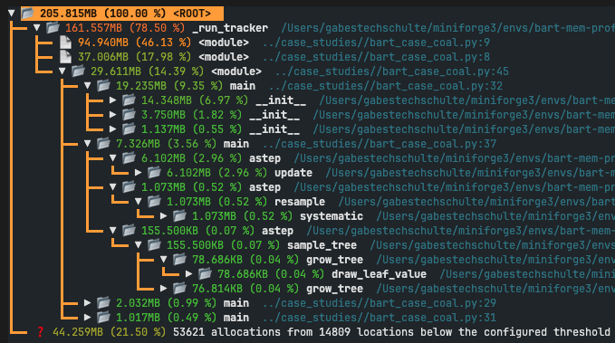
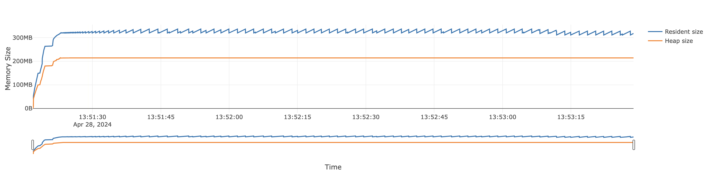

# PyMC-BART Code Profiling

Welcome to the PyMC-BART memory profiler.

## Getting started

Miniconda is used to setup the environment.

Once miniconda is installed, there is an `environment.yml` file to create an environment with all the dependencies needed to run the line profiling tests.

```bash
conda env create -f environment.yml
conda activate bart-mem-profiler
```

`memray` is used to profile the memory allocations and size of the `PGBART` sampler. To run the memory benchmarks, execute the following

```bash
bash benchmark.sh
```

This will run memory profiling benchmarks on the models in the `case_studies` directory with a variety of different hyperparameter values, and save the results in the `results` directory. There are multiple ways of analyzing the memray profile data. To visualize the memory profile data in a flame or icicle graph, run

```bash
python -m memray flamegraph results/<filename>.prof
```

and then open the generated `<memray-flamegraph>.html` file in a browser. The flamegraph only shows **a single point** in time when the process's heap memory usage was the **highest**. The flamegraph also includes a plot of total memory usage over time. 

Another meaningful way to analyze the memory profile data is via a tree reporter. A tree reporter provides a simplified representation of the call hierarchy of the tracked process **at the time** when its memory usage was **at its peak**. 

```bash
python -m memray tree results/<filename>.prof
```

When analyzing the memray profile data, it is often useful to hide "irrelevant" frames such as import system frames. 

It is also possible to observe heap memory usage in a "live" view. Live view lets you see what the peak heap usage has been and how much memory is being allocated by various parts of the program. The information is presented in a tabular format, showing how much of the in-use memory each function directly allocated (“own memory”), how much was cumulatively allocated by that function and everything it called (“total memory”), and the cumulative count of not yet freed allocations performed by that function and everything it called (“allocation count”).

```bash
memray run --live ../case_studies/bart_case_biking.py --trees 200 --particle 60
```

If you want to view high level statistics about the tracked process's **total** memory allocations and size, use the [stats reporter](https://bloomberg.github.io/memray/stats.html).

```bash
memray stats results/biking_50_20.prof
```

## Results

By default, `memray` profiles line-by-line memory usage. It is important to know that `memray` reports two different metrics: heap memory and resident memory. Refer to the [docs](https://bloomberg.github.io/memray/memory.html) for more information on these metrics. It is also important to know that in all the `memray` reporters, the reported memory usage is based on the **peak** memory usage of a process at a given point in time, **not** the cumulative memory usage over time.

Below, results and notes are given on the memory allocation when using the memray `tree` and `stat` reporter on the case study models. For the sake of brevity, only a subset of all the case study results are shown.

#### Biking

##### Tree reporter

500 iterations, 50 trees, 20 particles:



500 iterations, 200 trees, 60 particles:



##### Stats reporter

500 iterations, 50 trees, 20 particles:

```bash
📏 Total allocations:
        9656279

📦 Total memory allocated:
        9.009GB

📊 Histogram of allocation size:
        min: 0.000B
        ----------------------------------------------
        < 5.000B   :   38218 ▇
        < 32.000B  : 1413126 ▇▇▇▇▇▇▇▇▇▇
        < 181.000B : 1836425 ▇▇▇▇▇▇▇▇▇▇▇▇▇
        < 1.000KB  : 2663266 ▇▇▇▇▇▇▇▇▇▇▇▇▇▇▇▇▇▇▇
        < 5.656KB  : 3666811 ▇▇▇▇▇▇▇▇▇▇▇▇▇▇▇▇▇▇▇▇▇▇▇▇▇
        < 31.999KB :   36508 ▇
        < 181.019KB:    1756 ▇
        < 1.000MB  :      58 ▇
        < 5.657MB  :     110 ▇
        <=32.000MB :       1 ▇
        ----------------------------------------------
        max: 32.000MB

📂 Allocator type distribution:
         MALLOC: 9563324
         REALLOC: 45073
         CALLOC: 26103
         MMAP: 21764
         POSIX_MEMALIGN: 14
         ALIGNED_ALLOC: 1

🥇 Top 10 largest allocating locations (by size):
        - _predict:/Users/gabestechschulte/miniforge3/envs/bart-mem-profiler/lib/python3.12/site-packages/pymc_bart/tree.py:230 -> 1.919GB
        - grow_tree:/Users/gabestechschulte/miniforge3/envs/bart-mem-profiler/lib/python3.12/site-packages/pymc_bart/pgbart.py:510 -> 1.069GB
        - grow_tree:/Users/gabestechschulte/miniforge3/envs/bart-mem-profiler/lib/python3.12/site-packages/pymc_bart/pgbart.py:509 -> 1.069GB
        - update_weight:/Users/gabestechschulte/miniforge3/envs/bart-mem-profiler/lib/python3.12/site-packages/pymc_bart/pgbart.py:382 -> 882.564MB
        - eye:/Users/gabestechschulte/miniforge3/envs/bart-mem-profiler/lib/python3.12/site-packages/numpy/lib/twodim_base.py:223 -> 834.383MB
        - grow_tree:/Users/gabestechschulte/miniforge3/envs/bart-mem-profiler/lib/python3.12/site-packages/pymc_bart/pgbart.py:485 -> 830.778MB
        - update_weight:/Users/gabestechschulte/miniforge3/envs/bart-mem-profiler/lib/python3.12/site-packages/pymc_bart/pgbart.py:378 -> 601.056MB
        - __call__:/Users/gabestechschulte/miniforge3/envs/bart-mem-profiler/lib/python3.12/site-packages/pytensor/compile/function/types.py:970 -> 442.550MB
        - __call__:/Users/gabestechschulte/miniforge3/envs/bart-mem-profiler/lib/python3.12/site-packages/llvmlite/binding/ffi.py:192 -> 295.348MB
        - _compile_bytecode:<frozen importlib._bootstrap_external>:753 -> 106.008MB

🥇 Top 10 largest allocating locations (by number of allocations):
        - _predict:/Users/gabestechschulte/miniforge3/envs/bart-mem-profiler/lib/python3.12/site-packages/pymc_bart/tree.py:230 -> 2157158
        - draw_leaf_value:/Users/gabestechschulte/miniforge3/envs/bart-mem-profiler/lib/python3.12/site-packages/pymc_bart/pgbart.py:554 -> 1610889
        - grow_tree:/Users/gabestechschulte/miniforge3/envs/bart-mem-profiler/lib/python3.12/site-packages/pymc_bart/pgbart.py:510 -> 1097049
        - grow_tree:/Users/gabestechschulte/miniforge3/envs/bart-mem-profiler/lib/python3.12/site-packages/pymc_bart/pgbart.py:509 -> 1096364
        - __call__:/Users/gabestechschulte/miniforge3/envs/bart-mem-profiler/lib/python3.12/site-packages/llvmlite/binding/ffi.py:192 -> 665573
        - grow_tree:/Users/gabestechschulte/miniforge3/envs/bart-mem-profiler/lib/python3.12/site-packages/pymc_bart/pgbart.py:485 -> 606616
        - update_weight:/Users/gabestechschulte/miniforge3/envs/bart-mem-profiler/lib/python3.12/site-packages/pymc_bart/pgbart.py:378 -> 332414
        - eye:/Users/gabestechschulte/miniforge3/envs/bart-mem-profiler/lib/python3.12/site-packages/numpy/lib/twodim_base.py:223 -> 332414
        - __call__:/Users/gabestechschulte/miniforge3/envs/bart-mem-profiler/lib/python3.12/site-packages/pytensor/compile/function/types.py:970 -> 332413
        - update_weight:/Users/gabestechschulte/miniforge3/envs/bart-mem-profiler/lib/python3.12/site-packages/pymc_bart/pgbart.py:382 -> 332412
```

500 iterations, 200 trees, 60 particles:

```bash
📏 Total allocations:
        102725425

📦 Total memory allocated:
        93.243GB

📊 Histogram of allocation size:
        min: 0.000B
        -----------------------------------------------
        < 5.000B   :   212171 ▇
        < 32.000B  : 14890249 ▇▇▇▇▇▇▇▇▇▇
        < 181.000B : 17342684 ▇▇▇▇▇▇▇▇▇▇▇
        < 1.000KB  : 28959489 ▇▇▇▇▇▇▇▇▇▇▇▇▇▇▇▇▇▇
        < 5.656KB  : 41278779 ▇▇▇▇▇▇▇▇▇▇▇▇▇▇▇▇▇▇▇▇▇▇▇▇▇
        < 31.999KB :    40131 ▇
        < 181.019KB:     1753 ▇
        < 1.000MB  :       58 ▇
        < 5.657MB  :      110 ▇
        <=32.000MB :        1 ▇
        -----------------------------------------------
        max: 32.000MB

📂 Allocator type distribution:
         MALLOC: 102632609
         REALLOC: 44934
         CALLOC: 26103
         MMAP: 21764
         POSIX_MEMALIGN: 14
         ALIGNED_ALLOC: 1

🥇 Top 10 largest allocating locations (by size):
        - _predict:/Users/gabestechschulte/miniforge3/envs/bart-mem-profiler/lib/python3.12/site-packages/pymc_bart/tree.py:230 -> 21.914GB
        - grow_tree:/Users/gabestechschulte/miniforge3/envs/bart-mem-profiler/lib/python3.12/site-packages/pymc_bart/pgbart.py:510 -> 12.902GB
        - grow_tree:/Users/gabestechschulte/miniforge3/envs/bart-mem-profiler/lib/python3.12/site-packages/pymc_bart/pgbart.py:509 -> 12.901GB
        - update_weight:/Users/gabestechschulte/miniforge3/envs/bart-mem-profiler/lib/python3.12/site-packages/pymc_bart/pgbart.py:382 -> 10.186GB
        - grow_tree:/Users/gabestechschulte/miniforge3/envs/bart-mem-profiler/lib/python3.12/site-packages/pymc_bart/pgbart.py:485 -> 9.841GB
        - eye:/Users/gabestechschulte/miniforge3/envs/bart-mem-profiler/lib/python3.12/site-packages/numpy/lib/twodim_base.py:223 -> 9.630GB
        - update_weight:/Users/gabestechschulte/miniforge3/envs/bart-mem-profiler/lib/python3.12/site-packages/pymc_bart/pgbart.py:378 -> 6.937GB
        - __call__:/Users/gabestechschulte/miniforge3/envs/bart-mem-profiler/lib/python3.12/site-packages/pytensor/compile/function/types.py:970 -> 5.108GB
        - draw_leaf_value:/Users/gabestechschulte/miniforge3/envs/bart-mem-profiler/lib/python3.12/site-packages/pymc_bart/pgbart.py:554 -> 1.109GB
        - grow_tree:/Users/gabestechschulte/miniforge3/envs/bart-mem-profiler/lib/python3.12/site-packages/pymc_bart/pgbart.py:495 -> 704.667MB

🥇 Top 10 largest allocating locations (by number of allocations):
        - _predict:/Users/gabestechschulte/miniforge3/envs/bart-mem-profiler/lib/python3.12/site-packages/pymc_bart/tree.py:230 -> 24301432
        - draw_leaf_value:/Users/gabestechschulte/miniforge3/envs/bart-mem-profiler/lib/python3.12/site-packages/pymc_bart/pgbart.py:554 -> 19279041
        - grow_tree:/Users/gabestechschulte/miniforge3/envs/bart-mem-profiler/lib/python3.12/site-packages/pymc_bart/pgbart.py:510 -> 13138582
        - grow_tree:/Users/gabestechschulte/miniforge3/envs/bart-mem-profiler/lib/python3.12/site-packages/pymc_bart/pgbart.py:509 -> 13128583
        - grow_tree:/Users/gabestechschulte/miniforge3/envs/bart-mem-profiler/lib/python3.12/site-packages/pymc_bart/pgbart.py:485 -> 7278769
        - update_weight:/Users/gabestechschulte/miniforge3/envs/bart-mem-profiler/lib/python3.12/site-packages/pymc_bart/pgbart.py:378 -> 3928478
        - eye:/Users/gabestechschulte/miniforge3/envs/bart-mem-profiler/lib/python3.12/site-packages/numpy/lib/twodim_base.py:223 -> 3928478
        - __call__:/Users/gabestechschulte/miniforge3/envs/bart-mem-profiler/lib/python3.12/site-packages/pytensor/compile/function/types.py:970 -> 3928477
        - update_weight:/Users/gabestechschulte/miniforge3/envs/bart-mem-profiler/lib/python3.12/site-packages/pymc_bart/pgbart.py:382 -> 3928476
        - grow_tree:/Users/gabestechschulte/miniforge3/envs/bart-mem-profiler/lib/python3.12/site-packages/pymc_bart/pgbart.py:495 -> 3908476
```

#### Coal

##### Tree reporter

500 iterations, 50 trees, 20 particles:



500 iterations, 200 trees, 60 particles:



##### Stats reporter

500 iterations, 50 trees, 20 particles:

```bash
📏 Total allocations:
        8074398

📦 Total memory allocated:
        4.931GB

📊 Histogram of allocation size:
        min: 0.000B
        ----------------------------------------------
        < 5.000B   :   93050 ▇
        < 32.000B  : 1597189 ▇▇▇▇▇▇▇▇▇▇▇▇▇▇▇▇
        < 181.000B : 2651863 ▇▇▇▇▇▇▇▇▇▇▇▇▇▇▇▇▇▇▇▇▇▇▇▇▇
        < 1.000KB  : 1861743 ▇▇▇▇▇▇▇▇▇▇▇▇▇▇▇▇▇▇
        < 5.656KB  : 1830497 ▇▇▇▇▇▇▇▇▇▇▇▇▇▇▇▇▇▇
        < 31.999KB :   38146 ▇
        < 181.019KB:    1744 ▇
        < 1.000MB  :      55 ▇
        < 5.657MB  :     110 ▇
        <=32.000MB :       1 ▇
        ----------------------------------------------
        max: 32.000MB

📂 Allocator type distribution:
         MALLOC: 7979831
         REALLOC: 44975
         CALLOC: 26083
         MMAP: 23494
         POSIX_MEMALIGN: 14
         ALIGNED_ALLOC: 1

🥇 Top 10 largest allocating locations (by size):
        - _predict:/Users/gabestechschulte/miniforge3/envs/bart-mem-profiler/lib/python3.12/site-packages/pymc_bart/tree.py:230 -> 1.063GB
        - eye:/Users/gabestechschulte/miniforge3/envs/bart-mem-profiler/lib/python3.12/site-packages/numpy/lib/twodim_base.py:223 -> 805.432MB
        - grow_tree:/Users/gabestechschulte/miniforge3/envs/bart-mem-profiler/lib/python3.12/site-packages/pymc_bart/pgbart.py:510 -> 638.365MB
        - grow_tree:/Users/gabestechschulte/miniforge3/envs/bart-mem-profiler/lib/python3.12/site-packages/pymc_bart/pgbart.py:509 -> 638.283MB
        - grow_tree:/Users/gabestechschulte/miniforge3/envs/bart-mem-profiler/lib/python3.12/site-packages/pymc_bart/pgbart.py:485 -> 347.695MB
        - __call__:/Users/gabestechschulte/miniforge3/envs/bart-mem-profiler/lib/python3.12/site-packages/llvmlite/binding/ffi.py:192 -> 295.421MB
        - update_weight:/Users/gabestechschulte/miniforge3/envs/bart-mem-profiler/lib/python3.12/site-packages/pymc_bart/pgbart.py:378 -> 154.231MB
        - _compile_bytecode:<frozen importlib._bootstrap_external>:753 -> 113.008MB
        - get_data:<frozen importlib._bootstrap_external>:1187 -> 100.583MB
        - draw_leaf_value:/Users/gabestechschulte/miniforge3/envs/bart-mem-profiler/lib/python3.12/site-packages/pymc_bart/pgbart.py:554 -> 79.873MB

🥇 Top 10 largest allocating locations (by number of allocations):
        - _predict:/Users/gabestechschulte/miniforge3/envs/bart-mem-profiler/lib/python3.12/site-packages/pymc_bart/tree.py:230 -> 2062592
        - draw_leaf_value:/Users/gabestechschulte/miniforge3/envs/bart-mem-profiler/lib/python3.12/site-packages/pymc_bart/pgbart.py:554 -> 1316019
        - grow_tree:/Users/gabestechschulte/miniforge3/envs/bart-mem-profiler/lib/python3.12/site-packages/pymc_bart/pgbart.py:510 -> 952842
        - grow_tree:/Users/gabestechschulte/miniforge3/envs/bart-mem-profiler/lib/python3.12/site-packages/pymc_bart/pgbart.py:509 -> 948452
        - __call__:/Users/gabestechschulte/miniforge3/envs/bart-mem-profiler/lib/python3.12/site-packages/llvmlite/binding/ffi.py:192 -> 665750
        - grow_tree:/Users/gabestechschulte/miniforge3/envs/bart-mem-profiler/lib/python3.12/site-packages/pymc_bart/pgbart.py:485 -> 501356
        - eye:/Users/gabestechschulte/miniforge3/envs/bart-mem-profiler/lib/python3.12/site-packages/numpy/lib/twodim_base.py:223 -> 320881
        - grow_tree:/Users/gabestechschulte/miniforge3/envs/bart-mem-profiler/lib/python3.12/site-packages/pymc_bart/pgbart.py:495 -> 315878
        - draw_leaf_value:/Users/gabestechschulte/miniforge3/envs/bart-mem-profiler/lib/python3.12/site-packages/pymc_bart/pgbart.py:547 -> 183712
        - grow_tree:/Users/gabestechschulte/miniforge3/envs/bart-mem-profiler/lib/python3.12/site-packages/pymc_bart/pgbart.py:512 -> 162893
```

500 iterations, 200 trees, 60 particles:

```bash
📏 Total allocations:
        86709670

📦 Total memory allocated:
        45.698GB

📊 Histogram of allocation size:
        min: 0.000B
        -----------------------------------------------
        < 5.000B   :  1043519 ▇
        < 32.000B  : 17757850 ▇▇▇▇▇▇▇▇▇▇▇▇▇▇▇▇
        < 181.000B : 27865116 ▇▇▇▇▇▇▇▇▇▇▇▇▇▇▇▇▇▇▇▇▇▇▇▇▇
        < 1.000KB  : 20155957 ▇▇▇▇▇▇▇▇▇▇▇▇▇▇▇▇▇▇▇
        < 5.656KB  : 19843593 ▇▇▇▇▇▇▇▇▇▇▇▇▇▇▇▇▇▇
        < 31.999KB :    41722 ▇
        < 181.019KB:     1747 ▇
        < 1.000MB  :       55 ▇
        < 5.657MB  :      110 ▇
        <=32.000MB :        1 ▇
        -----------------------------------------------
        max: 32.000MB

📂 Allocator type distribution:
         MALLOC: 86615176
         REALLOC: 44900
         CALLOC: 26085
         MMAP: 23494
         POSIX_MEMALIGN: 14
         ALIGNED_ALLOC: 1

🥇 Top 10 largest allocating locations (by size):
        - _predict:/Users/gabestechschulte/miniforge3/envs/bart-mem-profiler/lib/python3.12/site-packages/pymc_bart/tree.py:230 -> 12.375GB
        - eye:/Users/gabestechschulte/miniforge3/envs/bart-mem-profiler/lib/python3.12/site-packages/numpy/lib/twodim_base.py:223 -> 9.472GB
        - grow_tree:/Users/gabestechschulte/miniforge3/envs/bart-mem-profiler/lib/python3.12/site-packages/pymc_bart/pgbart.py:510 -> 7.596GB
        - grow_tree:/Users/gabestechschulte/miniforge3/envs/bart-mem-profiler/lib/python3.12/site-packages/pymc_bart/pgbart.py:509 -> 7.590GB
        - grow_tree:/Users/gabestechschulte/miniforge3/envs/bart-mem-profiler/lib/python3.12/site-packages/pymc_bart/pgbart.py:485 -> 4.122GB
        - update_weight:/Users/gabestechschulte/miniforge3/envs/bart-mem-profiler/lib/python3.12/site-packages/pymc_bart/pgbart.py:378 -> 1.814GB
        - draw_leaf_value:/Users/gabestechschulte/miniforge3/envs/bart-mem-profiler/lib/python3.12/site-packages/pymc_bart/pgbart.py:554 -> 975.096MB
        - grow_tree:/Users/gabestechschulte/miniforge3/envs/bart-mem-profiler/lib/python3.12/site-packages/pymc_bart/pgbart.py:495 -> 325.997MB
        - __call__:/Users/gabestechschulte/miniforge3/envs/bart-mem-profiler/lib/python3.12/site-packages/llvmlite/binding/ffi.py:192 -> 295.410MB
        - _compile_bytecode:<frozen importlib._bootstrap_external>:753 -> 115.008MB

🥇 Top 10 largest allocating locations (by number of allocations):
        - _predict:/Users/gabestechschulte/miniforge3/envs/bart-mem-profiler/lib/python3.12/site-packages/pymc_bart/tree.py:230 -> 23990395
        - draw_leaf_value:/Users/gabestechschulte/miniforge3/envs/bart-mem-profiler/lib/python3.12/site-packages/pymc_bart/pgbart.py:554 -> 16150222
        - grow_tree:/Users/gabestechschulte/miniforge3/envs/bart-mem-profiler/lib/python3.12/site-packages/pymc_bart/pgbart.py:510 -> 11860614
        - grow_tree:/Users/gabestechschulte/miniforge3/envs/bart-mem-profiler/lib/python3.12/site-packages/pymc_bart/pgbart.py:509 -> 11599421
        - grow_tree:/Users/gabestechschulte/miniforge3/envs/bart-mem-profiler/lib/python3.12/site-packages/pymc_bart/pgbart.py:485 -> 6090839
        - eye:/Users/gabestechschulte/miniforge3/envs/bart-mem-profiler/lib/python3.12/site-packages/numpy/lib/twodim_base.py:223 -> 3864091
        - grow_tree:/Users/gabestechschulte/miniforge3/envs/bart-mem-profiler/lib/python3.12/site-packages/pymc_bart/pgbart.py:495 -> 3844088
        - draw_leaf_value:/Users/gabestechschulte/miniforge3/envs/bart-mem-profiler/lib/python3.12/site-packages/pymc_bart/pgbart.py:547 -> 2249383
        - grow_tree:/Users/gabestechschulte/miniforge3/envs/bart-mem-profiler/lib/python3.12/site-packages/pymc_bart/pgbart.py:512 -> 1989355
        - update_weight:/Users/gabestechschulte/miniforge3/envs/bart-mem-profiler/lib/python3.12/site-packages/pymc_bart/pgbart.py:378 -> 1932046
```

### Summary

#### Peak memory size and allocations at a given point in time

With `memray`, the majority of peak memory size (ignoring import and irrelevant frames) at any given point in time comes from the initialization of PG-BART when calling `pmb.PGBART`. Within the `astep` method, the memory size as a percent of total, is relatvively low. Nonetheless, within `astep`, the main memory usages comes from `update`, `resample`, and `sample_tree`. This makes intuitive sense as these methods or functions are responsible for growing the trees, updating the weights, and then resampling of the particles using the new weights.

This insight can be verified by either: (1) running the `memray` live view, or (2) viewing a temporal flame graph. Below is a screenshot of a temporal flame graph for the biking case study with 500 iterations, 200 trees, and 60 particles.

```bash
python -m memray flamegraph --temporal results/biking_200_60.prof
```



A large increase in resident and heap size is observed due to import frames and the initialization of PG-BART. After, resident and heap size increase and then becomes constant. 

Another interesting observation is that max heap usage is typically always greater than 200MB regardless of the case study, number of trees, and number of particles. This is likely due to the overhead of import frames. 

#### Total memory allocations and size

Reading the section above, it appears that PG-BART is "fairly" memory efficient. However, most of the statistics above represent the peak memory size at a given point in time. It is also important to consider the total memory allocations and size over the course of the entire program execution. This can be achieved with the `memray` stats reporter. 

Alarmingly, if this is even right, total memory size can range from 4GB to 93GB depending on the case study and hyperparameters. The top 10 largest allocation locations (by size and number of allocations) across all case studies are:

* `_predict` 
* `grow_tree`
* `update_weight`
* `draw_leaf_value`

This is consistent with the results from the "peak memory allocations and size at a given point in time" section.